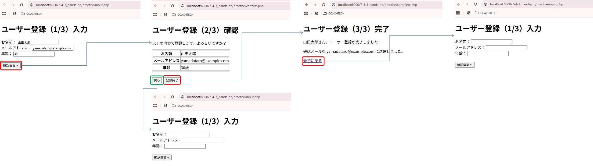

# php-form-practice

## 概要

COACHTECH 教材 Tutorial 7-4「フォームとデータ受け渡し ハンズオン演習」で作成した成果物です。
ユーザー情報を入力し、確認画面、完了画面へ遷移するプログラムです。

## 使用技術

- PHP 8.x
- HTML5（フォーム要素）
- CSS

## 学んだこと

- formを使用したデータの受け渡し
- tableタグの書き方、CSS設定方法
- aタグの使用方法
- touchコマンドで複数ファイルを作成出来る
- history.back()

## 詰まったポイントと解決方法

- 確認画面の「戻る」ボタンの装飾
  -- 「<input type=button>で表示されるような見た目にするCSSを教えて」とAIに聞いた

## 動作確認

1. Dockerの起動
   1. ターミナルで`~/php-practice`ディレクトリに移動する
   2. `docker compose up -d` コマンドでDockerを起動する
2. ファイルにアクセスする
   1. ブラウザでhttp://localhost:8000/7-4-3_hands-on/practice/input.php にアクセスする

### 動作確認スクショ

